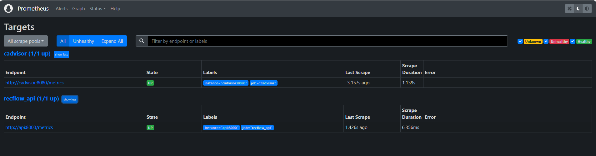
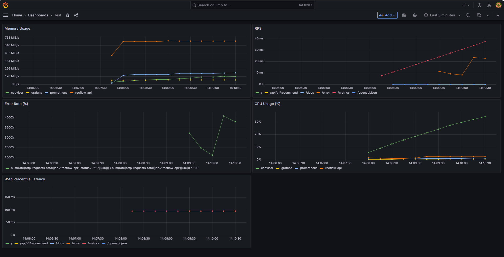

# RecFlow Engine: An Enriched, Production-Ready Recommender System


A comprehensive, end-to-end book recommendation system designed with a production-first MLOps mindset. **RecFlow Engine** combines the power of semantic search with intelligent NLP-driven filtering, all packaged in a robust, scalable, and observable API service.

---

## Core Features
- **Semantic Search**: Understands the meaning behind a user's query, not just keywords. Find books based on plot, themes, or writing style.  
- **Intelligent Filtering**: Dynamically filter recommendations by `predicted_category` (e.g., *Fantasy*) and `sentiment` (e.g., *POSITIVE*), which are generated automatically by NLP models.  
- **Production-Ready API**: A high-performance, asynchronous API built with FastAPI, fully documented with Swagger UI.  
- **End-to-End MLOps**: Containerized with Docker, orchestrated with Docker Compose, and continuously integrated/deployed via GitHub Actions.  
- **Full Observability**: Monitoring stack with Prometheus, Grafana, and cAdvisor to track API performance and system health in real-time.  

---

## System Architecture

RecFlow Engine is built on the **"Offline Enrichment, Online Serving"** philosophy to ensure low-latency responses for the end-user.

- **Offline Pipeline**: Performs heavy NLP enrichment (zero-shot classification, sentiment analysis), generates embeddings with Sentence-Transformers, and builds a FAISS vector index.  
- **Online API**: Serves recommendation requests in real-time by leveraging the pre-computed artifacts.  
- **MLOps Infrastructure**: Automated CI/CD workflows and integrated monitoring.  


---

## Tech Stack

| Category                  | Technology / Library                                                                |
| ------------------------- | ----------------------------------------------------------------------------------- |
| **MLOps & Infrastructure**| `Docker`, `Docker Compose`, `GitHub Actions`, `Prometheus`, `Grafana`, `cAdvisor`     |
| **Backend & API**         | `FastAPI`, `Uvicorn`, `Pydantic`, `prometheus-fastapi-instrumentator`               |
| **NLP & Vector Search**   | `Hugging Face Transformers`, `Sentence-Transformers`, `FAISS`, `LangChain`, `PyTorch` |
| **Data Processing**       | `Pandas`, `PyArrow`                                                                 |
| **Testing & Linting**     | `Pytest`, `pytest-mock`, `Ruff`, `httpx`                                            

---

## Getting Started

You can run the entire system—including the API and monitoring stack—with just a few commands.

### Prerequisites
- [Docker](https://www.docker.com/) & Docker Compose installed  
- Git for cloning the repository  
- At least 4GB RAM allocated to Docker  

### 1. Clone the Repository
```bash
git clone https://github.com/n1giahuy/RecFlow-Engine.git
cd RecFlow-Engine
````

### 2. Prepare the Data & Artifacts

The API requires **pre-computed artifacts** (the enriched dataset and FAISS index), which are located in the [`artifacts/`](./artifacts) directory of this repo.

### 3. Launch the System

```bash
docker-compose up -d --build
```

This will:

* Build and start the FastAPI application
* Start Prometheus, Grafana, and cAdvisor

### 4. Explore the Services

* API (Swagger UI): [http://localhost:8000/docs](http://localhost:8000/docs)
* Grafana: [http://localhost:3000](http://localhost:3000) (Login: `admin/admin`)
* Prometheus: [http://localhost:9090/targets](http://localhost:9090/targets)
* cAdvisor: [http://localhost:8081](http://localhost:8081)

---

## API Usage Example

Interact via Swagger UI: [http://localhost:8000/docs](http://localhost:8000/docs)

**Request Example:**


**Response Example:**


---

## Monitoring & Observability

RecFlow Engine provides full observability out-of-the-box.

**Prometheus Targets:**
Prometheus scrapes metrics from API and cAdvisor.


**Grafana Dashboard:**
Visualize KPIs: memory, CPU, RPS, error rates, latency.


---

## Pre-built Docker Image

You can pull the pre-built API image directly from Docker Hub:

```bash
docker pull n1giahuy/recflow-engine:latest
```

Run it with local artifacts mounted:

```bash
docker run -d -p 8000:8000 \
  -v ./data/processed:/app/data/processed:ro \
  --name recflow_api \
  n1giahuy/recflow-engine:latest
```

---

## Testing

* **Unit Tests**: Run with `pytest`
* **CI Pipeline**: GitHub Actions runs linting & tests on every push
---

## License

This project is licensed under the [MIT License](./LICENSE).

---
